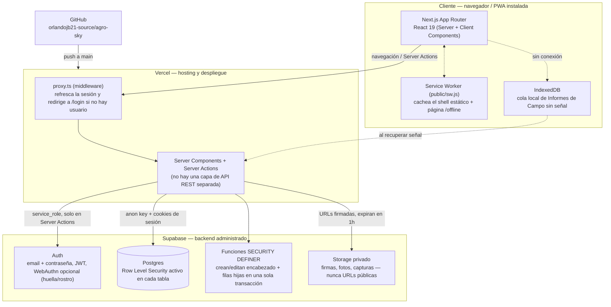
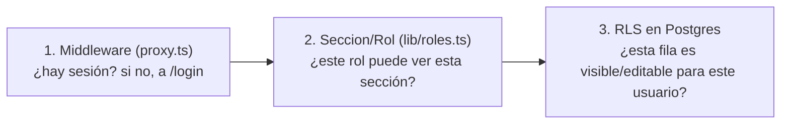

# Arquitectura — Agro Sky Panamá

> Documento de referencia técnica. Última actualización: 2026-08-01.

## 1. Qué es esta app

Sistema interno de gestión para Agro Sky Panamá (empresa de riego con drones):
inventario, bitácora, caja menuda, compras, planilla, ventas, informes de
campo/diario/proyecto, balance y administración de usuarios. Es una PWA
(instalable en celular) usada por 3 roles: **administrador**, **jefe** y
**soporte**.

## 2. Vista general



**Dominio:** `agroskypty.app` (Vercel), repo en GitHub, cada `git push` a
`main` dispara un despliegue automático en Vercel (no hay pipeline de CI
explícito en el repo — las verificaciones antes de cada cambio son
manuales: `tsc`, `eslint`, `next build`, y pruebas antes de subir).

## 3. Capas

### 3.1 Frontend — Next.js App Router

- **Server Components** por defecto: cada página carga sus datos
  directamente con el cliente de Supabase del servidor (sin pasar por una
  API intermedia).
- **Client Components** (`"use client"`) solo donde hace falta interacción
  (formularios, tablas con filtros, canvas de firma).
- **Server Actions** (`"use server"`) son la única forma de escribir datos
  — validación con `zod` antes de tocar la base de datos, siempre.
- **PWA**: `manifest.ts` + `public/sw.js` (cachea solo el shell estático y
  una página `/offline` de respaldo; deja pasar todo `POST`/Server Action
  sin tocar, a propósito) + `PwaRegister.tsx` (registra el service worker
  solo en producción).
- **Modo sin conexión** (Informe de Campo, agregado 2026-08-01): si no hay
  señal al guardar, los datos y las 2 firmas se guardan en IndexedDB del
  propio celular y se suben solos cuando la app detecta conexión de nuevo
  (mientras la app sigue abierta — no hay sincronización real con la app
  cerrada).

### 3.2 Backend — Server Actions, sin API REST separada

No existe una capa de API tradicional: cada Server Action es, en la
práctica, un endpoint con su propio contrato de entrada (`FormData`) y
salida (`{ error, values }` vía `useActionState`, o un valor de retorno
directo para llamadas fuera de un `<form>`).

Dos patrones de escritura, según la complejidad:

1. **Tabla simple** (`planilla_pagos`, `caja_gastos`, `informes_diarios`):
   `insert`/`update`/`delete` directo desde el Server Action, protegido
   por RLS.
2. **Encabezado + filas hijas** (`proyecto_informes`+`proyecto_filas`,
   `informes_campo`+parcelas/productos, `ventas`+`venta_items`,
   `cotizaciones`+`cotizacion_items`, `ordenes_compra`+items,
   `solicitudes_compra`+items): siempre pasa por una función Postgres
   `security definer` (`crear_x`/`editar_x`/`eliminar_x`) que inserta el
   encabezado y recorre un `jsonb` con las filas, todo en una sola
   transacción — nunca un insert de header seguido de inserts sueltos de
   filas desde el cliente (evitaría estados a medias si algo falla a
   mitad de camino).

### 3.3 Datos — Supabase (Postgres + Auth + Storage)

**53 migraciones** aplicadas secuencialmente (`supabase/migrations/0001…`
hasta la más reciente), cada una un archivo SQL versionado en el repo,
aplicado a mano por el usuario en el SQL Editor de Supabase (no hay
`supabase db push` automatizado).

**Tablas principales por módulo:**

| Módulo | Tablas |
|---|---|
| Inventario | `racks`, `contenedores`, `productos`, `servicios` |
| Bitácora / Compras | `ordenes_compra`, `orden_compra_items`, `solicitudes_compra`, `solicitud_compra_items` |
| Caja Menuda | `caja_gastos`, `caja_reposiciones`, `caja_previstos`, `caja_arqueos` |
| Planilla | `colaboradores`, `planilla_asistencia`, `planilla_pagos` |
| Ventas | `clientes`, `ventas`, `venta_items`, `cotizaciones`, `cotizacion_items` |
| Informes → Campo | `informes_campo`, `informe_campo_parcelas`, `informe_campo_productos` |
| Informes → Diario | `informes_diarios` |
| Informes → Proyecto | `proyecto_informes`, `proyecto_filas`, `proyecto_gastos_operativos`, `proyecto_gastos_operativos_items`, `proyecto_operaciones`, `proyecto_personal_dias`, `proyecto_tramos` |
| Usuarios | `perfiles` (1:1 con `auth.users`) |

**Storage** (3 buckets, todos privados):

| Bucket | Contenido |
|---|---|
| `colaboradores-fotos` | Foto de cada colaborador |
| `informes-campo-firmas` | Las 2 firmas dibujadas por Informe de Campo |
| `informes-diarios-capturas` | Captura de pantalla del control del drone |

Ninguno es público — todo se muestra vía `createSignedUrl` (URL temporal,
1 hora) generada en el servidor. La ruta guardada en la base de datos
nunca es una URL, solo la ruta interna del objeto.

## 4. Autenticación y autorización (defensa en profundidad, 3 capas)



1. **Middleware** (`proxy.ts` + `lib/supabase/middleware.ts`): sin sesión
   válida, redirige a `/login` antes de que cargue cualquier página del
   dashboard.
2. **Gating por sección** (`lib/roles.ts`): cada sección de navegación
   (`Seccion`) tiene una lista de roles permitidos
   (`SECTION_ACCESS`); `requireSection()` la aplica en cada
   `layout.tsx`/`page.tsx` server-side (nunca solo ocultando un botón en
   el cliente).
3. **RLS en Postgres** — la capa que de verdad importa, porque es la
   única que no se puede saltar aunque alguien llame a Supabase
   directamente con el `anon key`: cada tabla tiene su propia política.
   Patrón repetido en todo el proyecto: cuando una sección está abierta a
   los 3 roles pero una parte es exclusiva de jefe/soporte (ej. Pagos de
   Fijo en Planilla), se usan **políticas aditivas** — una amplia para
   jefe/soporte (`auth_gestiona_usuarios()`) y otra más angosta con un
   `exists (...)` para el resto — nunca una sola política intentando
   cubrir los 2 casos a la vez.

**Perfiles y roles**: `perfiles.rol` restringido a
`administrador | jefe | soporte` (constraint de base de datos), 1:1 con
`auth.users`. Un usuario autenticado sin fila en `perfiles` ve una
pantalla de "cuenta pendiente de activación", no el dashboard.

**Segundo factor de conveniencia**: WebAuthn (huella/rostro) opcional,
guardado en el propio dispositivo (`localStorage`), nunca reemplaza la
contraseña — solo evita reescribirla en ese celular.

## 5. Exportación de documentos (PDF/Excel)

Todo el armado de PDF (`jsPDF`+`jspdf-autotable`) y Excel (`exceljs`)
ocurre **en el navegador**, nunca en el servidor — se arma con los datos
que ya llegaron a la página. Cada documento (Factura, Orden de Compra,
Talonario, Informe de Campo, Informe Diario, Informe de Proyecto) tiene su
propio membrete y función en `lib/exportar.ts`; la lógica de dibujo del
Informe de Campo está factorizada (`dibujarCuerpoInformeCampo`) para
poder reutilizarla dentro del Informe Diario sin duplicar el código.

## 6. Decisiones de diseño que vale la pena recordar

- **Nombres "fotografiados", no relaciones**: `colaborador`, `cliente`,
  `proveedor` viajan como texto libre en las tablas de movimientos (no
  FK) — si se borra un colaborador o cliente, los registros históricos no
  se rompen ni pierden el nombre.
- **Un cálculo por unidad de trabajo real**: el incentivo por hectárea
  (`lib/calculoIncentivos.ts`) se calcula una vez por cada Informe de
  Campo, nunca sumando hectáreas entre informes distintos aunque sean del
  mismo día y la misma persona.
- **Snapshots financieros, no recálculo en vivo**: el detalle día/informe
  que se ve en el Talonario de Campo se guarda tal cual quedó al momento
  de pagar (`planilla_pagos.detalle_calculo`), no se recalcula después —
  un documento de pago debe reflejar lo que realmente se pagó, no lo que
  la fórmula diría hoy si los datos de origen cambiaran.
- **La UI nunca decide sola qué campo mandar**: si un campo se oculta
  para un caso pero ya existía en un registro histórico, ese registro se
  sigue mostrando (y reenviando) igual al editar — un `<form>` nunca
  manda un campo que no renderiza, así que ocultarlo sin más borraría el
  dato en silencio al guardar.

## 7. Estructura de carpetas (resumen)

```
src/
  app/(dashboard)/       cada carpeta = una sección del menú (page.tsx, layout.tsx, [id]/...)
  components/
    ui/                  botones, Field/SelectField, PageHeader — genéricos, sin lógica de negocio
    forms/                formularios y tablas específicas de cada módulo
    layout/               Nav, banners globales (BiometricoAviso, SincronizadorInformesCampo)
  lib/
    actions/               Server Actions, una por módulo
    validation/             esquemas zod, uno por módulo
    supabase/               los 3 clientes (browser, server, admin)
    roles.ts, session.ts    el modelo de permisos
    exportar.ts             todo el armado de PDF/Excel
supabase/
  migrations/              0001...NNNN, una por cambio de esquema, aplicadas a mano
  schema.sql               snapshot base original
```
